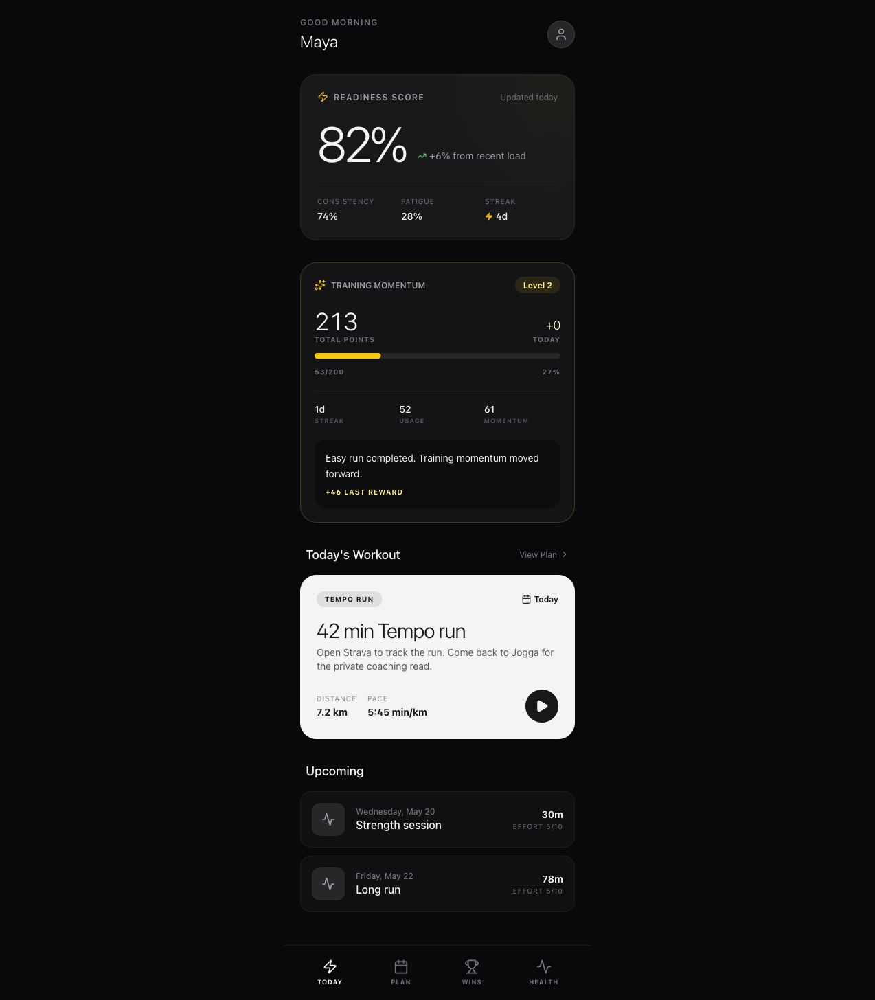
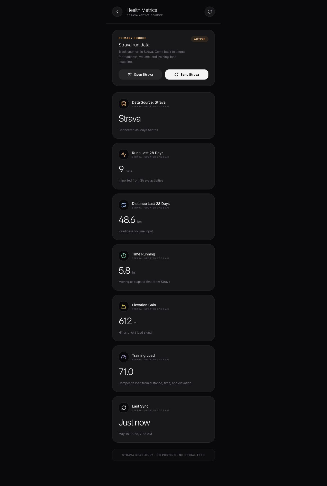
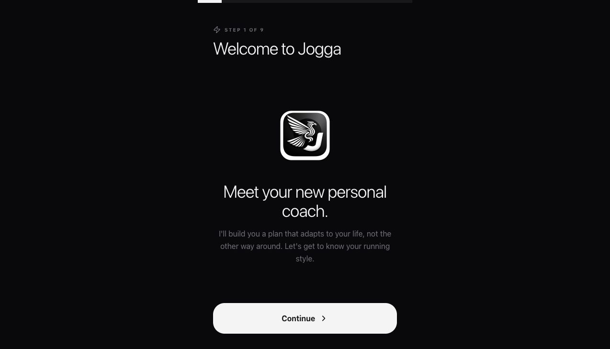
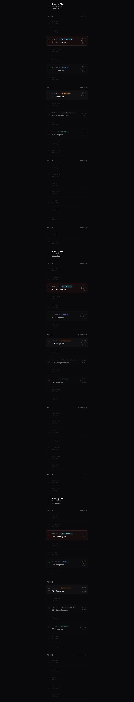
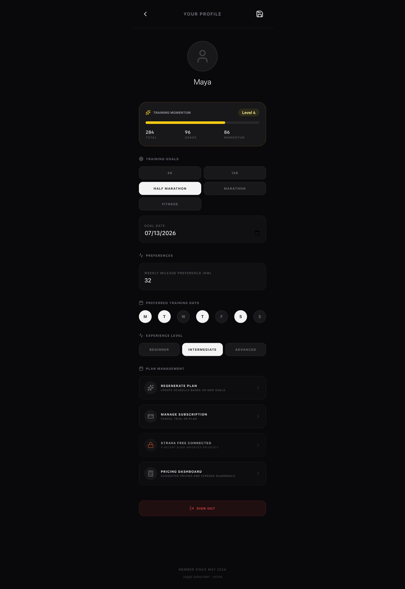

# Jogga - AI Running Coach

[](https://jogga.santosautomation.com)
[](https://react.dev)
[](https://www.typescriptlang.org)
[](https://vite.dev)
[](https://firebase.google.com)
[](https://stripe.com)
[](LICENSE)


Jogga is a production web app for adaptive running plans, GPS-tracked workouts, subscription access, and concise AI coaching. The app is built around deterministic training logic first: plan generation, mileage progression, readiness, rest-day handling, and workout adjustments do not depend on an LLM. AI is used only where it adds value, such as post-run coaching summaries and advanced coach explanations.

Live app: [https://jogga.santosautomation.com](https://jogga.santosautomation.com)

## Screenshots

Curated screenshots live in [docs/screenshots](docs/screenshots). Protected app screens use representative Strava-connected demo data so the gallery documents the product without exposing a real account.

| Dashboard | Strava Health Metrics | Onboarding |
| --- | --- | --- |
|  |  |  |

| Training Plan | Profile | Landing |
| --- | --- | --- |
|  |  |  |

## What It Does

- Builds personalized running plans from experience level, race goal, target date, preferred training days, and weekly mileage.
- Tracks real runs with GPS distance, pace, duration, route samples, and measurement metadata.
- Generates readiness and training feedback from deterministic workout history.
- Shows post-run coaching insights grounded in measured run data.
- Gates premium access through Stripe Checkout, Stripe Customer Portal, and verified webhooks.
- Uses Firebase Auth for Google sign-in and Firestore for user profiles, workouts, subscription state, and AI usage controls.
- Ships SEO landing pages for running plan searches and a PWA service worker for install/update flows.

## Current Production Shape

| Area | Status |
| --- | --- |
| Frontend | React 19, Vite 6, Tailwind CSS, Motion, Lucide |
| Backend | Vercel serverless API routes plus local Express dev server |
| Auth | Firebase Auth with Google sign-in |
| Database | Firestore user records and workout subcollections |
| Payments | Stripe subscriptions, Checkout, Customer Portal, webhook fulfillment |
| AI | Gemini preferred, OpenAI fallback, deterministic fallback if providers fail |
| Analytics | Google Analytics 4 via `VITE_GA_MEASUREMENT_ID` |
| SEO | Static guide pages, `sitemap.xml`, `robots.txt`, Google site verification |
| Domain | `jogga.santosautomation.com` on Vercel |

## Core Flows

1. Landing page CTA stores checkout intent and starts Google redirect auth.
2. New users complete onboarding before seeing the plan/paywall path.
3. Unpaid users see the single subscription screen.
4. Monthly, yearly, and trial options create server-side Stripe Checkout sessions.
5. Stripe webhooks write subscription truth to Firestore with Firebase Admin.
6. Active or trialing subscribers access the dashboard, plan, live tracking, and paid AI/audio features.
7. Canceled or past-due subscriptions are locked again unless the user has admin access.

## AI Cost Controls

Jogga is not built as an LLM wrapper. The expensive model calls are constrained:

- Training plans, mileage, rest days, pace guidance, readiness, missed-workout adjustment, and difficulty adjustment are deterministic.
- `/api/coach-opinion` requires Firebase auth.
- Free users receive 3 lifetime AI coach messages.
- Paid or trialing users receive 10 AI coach messages per UTC day.
- AI coach responses are capped at 180 words.
- Repeated coach responses are cached for 12 hours using the user ID, question type, readiness score, workout ID, and recent workout summary.
- If Gemini and OpenAI are unavailable, the API returns deterministic coaching text instead of breaking the app.
- `/api/audio-cue` remains subscription-gated and rate-limited.

## Repository Layout

```text
api/                         Vercel API routes
api/stripe/                  Stripe webhook fulfillment
scripts/                     Build-time SEO and smoke checks
src/components/              Main app screens and UI components
src/components/seo/          SEO landing page definitions and layout
src/config/                  Billing config and checkout intent constants
src/services/                Plan, readiness, AI, analytics, GPS, OAuth services
public/                      Logo, media, sitemap, robots, verification files
firestore.rules              Firestore security rules
server.ts                    Local Express dev server
vercel.json                  Production routing and function config
```

## Local Setup

Use Node 20+ for the cleanest match with Vercel.

```bash
git clone https://github.com/thereal-baitjet/jogga-fork.git
cd jogga-fork
npm install
cp .env.example .env
npm run dev
```

The dev server runs from `server.ts`. The production build uses Vite and the Vercel API route files.

```bash
npm run lint
npm run test:core
npm run build
```

## Environment Variables

Do not commit real secrets. Use `.env` locally and Vercel Environment Variables in production.

| Variable | Purpose |
| --- | --- |
| `APP_URL` | Public app URL used for Stripe redirects, OAuth callbacks, and self-referential links |
| `STRIPE_SECRET_KEY` | Server-only Stripe API key |
| `STRIPE_MONTHLY_PRICE_ID` | Stripe recurring monthly price |
| `STRIPE_YEARLY_PRICE_ID` | Stripe recurring yearly price |
| `STRIPE_WEBHOOK_SECRET` | Stripe webhook signature secret |
| `VITE_STRIPE_BILLING_PORTAL_URL` | Public fallback portal login URL |
| `FIREBASE_WEB_API_KEY` | Firebase Auth REST verification key |
| `FIREBASE_SERVICE_ACCOUNT_JSON` | Preferred server-only Firebase Admin credential |
| `FIREBASE_PROJECT_ID` | Split Firebase Admin credential fallback |
| `FIREBASE_CLIENT_EMAIL` | Split Firebase Admin credential fallback |
| `FIREBASE_PRIVATE_KEY` | Split Firebase Admin credential fallback |
| `GEMINI_API_KEY` | Preferred AI provider key |
| `OPENAI_API_KEY` | AI fallback provider key |
| `OPENAI_TEXT_MODEL` | Optional OpenAI text model override |
| `OPENAI_TTS_MODEL` | Optional OpenAI audio model override |
| `VITE_GOOGLE_MAPS_API_KEY` | Optional browser key for route map images |
| `VITE_GA_MEASUREMENT_ID` | GA4 measurement ID |
| `VITE_GOOGLE_OAUTH_CLIENT_ID` | Cordova Google OAuth web client ID |
| `VITE_CORDOVA_GOOGLE_REDIRECT_URI` | Cordova OAuth callback URL |
| `GOOGLE_CLIENT_ID` | Optional server-side Google Health fallback |
| `GOOGLE_CLIENT_SECRET` | Optional server-side Google Health fallback |

## Stripe Setup

Jogga uses server-created Stripe Checkout Sessions. Hosted Stripe Payment Links are not the primary app flow.

Required production setup:

1. Create monthly and yearly recurring Stripe Prices.
2. Add the price IDs to Vercel as `STRIPE_MONTHLY_PRICE_ID` and `STRIPE_YEARLY_PRICE_ID`.
3. Set `STRIPE_SECRET_KEY`.
4. Configure a Stripe webhook endpoint:

```text
https://jogga.santosautomation.com/api/stripe/webhook
```

5. Add the webhook secret as `STRIPE_WEBHOOK_SECRET`.
6. Set Firebase Admin credentials so webhook fulfillment can write `users/{uid}` server-side.

Webhook fulfillment updates:

- `isUnlocked`
- `accessSource`
- `stripeCustomerId`
- `stripeSubscriptionId`
- `stripePriceId`
- `subscriptionStatus`
- `subscriptionPlan`
- `subscriptionVerifiedAt`
- `updatedAt`

Active and trialing subscriptions unlock access. Canceled and past-due subscriptions lock access unless `accessSource` is `admin`.

## Firebase Setup

Enable Firebase Auth with Google sign-in and add these authorized domains:

```text
localhost
jogga-fork-main.vercel.app
jogga.santosautomation.com
```

Firestore stores user profile documents at `users/{uid}` and workouts under `users/{uid}/workouts`. Firestore rules are scoped so users can read and write their own user document and workout subcollection.

For production server writes, configure Firebase Admin with either:

```env
FIREBASE_SERVICE_ACCOUNT_JSON=
```

or:

```env
FIREBASE_PROJECT_ID=
FIREBASE_CLIENT_EMAIL=
FIREBASE_PRIVATE_KEY=
```

## Google Health And Cordova OAuth

The web/PWA health connection uses Firebase Google reauthentication with Google Fitness read scopes. The optional server endpoints under `/api/auth/google-health/*` remain available as a fallback and require `GOOGLE_CLIENT_ID` and `GOOGLE_CLIENT_SECRET`.

Cordova builds use `cordova-plugin-inappbrowser` and the browser-safe variables:

```env
VITE_GOOGLE_OAUTH_CLIENT_ID=
VITE_CORDOVA_GOOGLE_REDIRECT_URI=https://jogga.santosautomation.com/oauth/google/callback
```

Add the Cordova redirect URI to the same Google OAuth web client.

## SEO Pages

Static marketing pages are generated during `npm run build`:

- `/ai-running-coach`
- `/5k-training-plan`
- `/10k-training-plan`
- `/half-marathon-plan`
- `/marathon-training-plan`
- `/beginner-running-plan`

The build also keeps `public/sitemap.xml`, `public/robots.txt`, OpenGraph metadata, canonical URLs, JSON-LD, and Google site verification in place.

## Deployment

Production deploys through Vercel.

```bash
vercel deploy --prod --force
```

Custom domain:

```text
https://jogga.santosautomation.com
```

Vercel project:

```text
jogga-fork-main
```

After changing payments, auth, domain, or webhook behavior, verify:

```bash
curl -i https://jogga.santosautomation.com/api/create-checkout-session
curl -i -X POST https://jogga.santosautomation.com/api/coach-opinion \
  -H 'Content-Type: application/json' \
  --data '{"prompt":"health check"}'
```

Expected unauthenticated coach response is `401`. That confirms the API route is reachable and auth-gated.

## Maintenance Checks

Run these before pushing production changes:

```bash
npm run lint
npm run test:core
npm run build
```

The core smoke test covers deterministic plan generation, readiness, post-run fallback coaching, and render stability. It is intentionally separate from external AI, Stripe, and Firebase network calls.

## License

Apache License 2.0. See [LICENSE](LICENSE).
